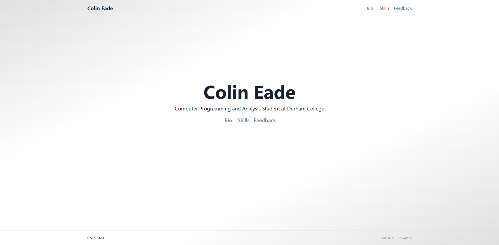

# Portfolio-Themed Web App with Integrated Services


## Demo


_Navigating the user interface._

<br>


_Demonstrating the filtering capabilities within the skills section._

<br>


_Showcasing the dynamic feedback wall, including post submission and browsing with infinite scroll/sorting._

## Project Overview

This application was developed during my fifth-semester Web Development – Frameworks course. It showcases a microservice-inspired architecture by integrating:

- **Static Frontend:** A Next.js Pages-based application handling presentation and user interaction.
- **Headless CMS:** Strapi for content management, with content fetched at build time.
- **Dynamic Content:** A user-driven feedback wall where visitors can submit rich-text comments and browse contributions, powered by Next.js API Routes and AWS DynamoDB.

This project demonstrates modern web practices such as static site generation, decoupled content management, and cloud service integration, serving as a practical exploration of these modern web technologies.

## Key Features

### Static Site with Next.js

- Clean, responsive UI developed with Chakra UI components.
- Page navigation via Next.js client-side routing.
- TypeScript employed for type safety and improved code quality.

### Strapi CMS Integration

- Content fetched from Strapi at build time for optimized performance.
- Clear separation of content management from the presentation layer.
- Content updates managed in Strapi, reflected upon site rebuild.

### Dynamic Feedback Wall

- Enables dynamic submission of rich-text feedback by visitors, which is then displayed in a scrollable, card-based layout.
- Feedback is submitted through a modal form featuring custom components like a star rating system.
- Application state and API interactions (fetching, posting) are managed by Redux Toolkit (RTK Query), enabling features such as infinite scroll for seamless browsing and user-selectable sorting options (e.g., by date, rating).
- Utilizes Tiptap to provide rich text editing capabilities for feedback composition, allowing various formatting options.
- All feedback posts are persistently stored and retrieved from AWS DynamoDB via Next.js API Routes.

## Technology Stack

### Frontend

- **Next.js**: Framework for server-rendering and static site generation.
- **TypeScript**: For static typing and enhanced code quality.
- **React**: Core library for building user interfaces.
- **Redux Toolkit (RTK Query)**: For application state management and API data fetching.
- **Chakra UI**: Component library for UI development.
- **Tiptap**: For rich text editing functionality.
- **React Hook Form**: For form state management and validation.

### Content Management

- **Strapi**: Headless CMS for managing site content.
- **Static Site Generation**: Content from CMS fetched at build time.

### Backend & Infrastructure (via Next.js API Routes)

- **Next.js API Routes**: For serverless backend logic.
- **AWS DynamoDB**: NoSQL database for feedback data persistence.
- **AWS SDK**: For interacting with AWS services (DynamoDB).
- **Zod**: For server-side input validation in API routes.
- **Sanitize-HTML**: For securing user-generated HTML content.

## Architecture

The application architecture emphasizes a separation of concerns between its distinct service components:

```text
┌─────────────────────┐     ┌─────────────────────┐
│  Next.js Frontend   │ ◄───┤   Strapi CMS API    │
│  (Static Content)   │     │   (Content Data)    │
│  (Chakra UI, Redux) │     │                     │
└──────────┬──────────┘     └─────────────────────┘
           │
           │ Next.js API Routes
           │ (Serverless Functions)
           ▼
┌─────────────────────┐
│  AWS DynamoDB       │
│  (Dynamic Feedback) │
│                     │
└─────────────────────┘
```

## Implementation Highlights

### Microservice-Inspired Approach

- Demonstrates microservice-inspired principles with clear boundaries between the presentation layer (Next.js), content management (Strapi), and dynamic data persistence (DynamoDB via Next.js API routes).

### Static Site Generation (SSG)

- Effectively utilizes Next.js's SSG capabilities for performance, with content sourced from the headless CMS at build time.

### UI Components & Interactions

- Developed a responsive layout using Chakra UI.
- Implemented interactive UI elements, including a custom Star Rating system and a Tiptap-based rich text editor for feedback.
- Incorporated client-side data fetching with RTK Query, enabling features like infinite scroll and dynamic sorting for the feedback page display.

### Server-Side Integration (Next.js API Routes)

- Configured AWS SDK for secure and efficient DynamoDB access within serverless functions.
- Structured API routes following a controller-service pattern for clarity and maintainability.
- Implemented server-side validation using Zod and HTML content sanitization (sanitize-html) to protect against invalid or malicious submissions for the dynamic feedback wall.

## Lessons Learned

Key takeaways include:

- Gained more proficiency with Next.js, exploring its server-side/client-side rendering, file-system routing, API routes, and full-stack features.
- Gained practical implementation experience with headless CMS architecture using Strapi, understanding its benefits for decoupled content management and build-time data fetching.
- Acquired practical AWS experience (DynamoDB) in a personal project, managing the NoSQL database resource and SDK integration for dynamic data.
- Deepened understanding of the trade-offs and synergies between static content delivery and dynamic, interactive web functionalities.

---

**Note on Running:** This project was developed as an academic exercise for the Web Development – Frameworks course. It relies on external services (a self-hosted or cloud Strapi CMS instance, AWS DynamoDB) and specific environment configurations (as outlined in `.env.example` files or similar) for full functionality. Direct local execution requires setting up these services and populating all necessary environment variables. **The code is primarily provided for review of its Next.js implementation, architectural patterns, and service integration techniques.**
